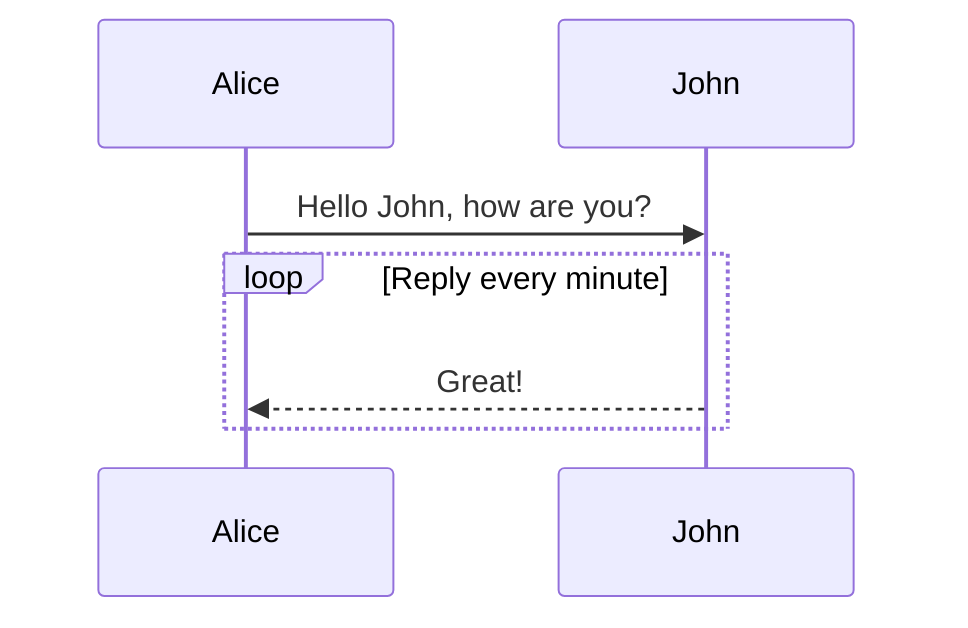

#Economy

- No currency, or rather all is currency, all is consumable.]
- Essentially everythign int he game is currency.
	- Items, recipies, factories, ships, inventory, waste
	- Anything that can be in inventory can be traded or used.

